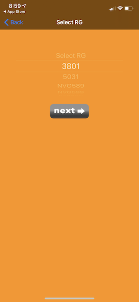
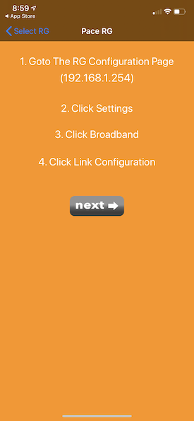

# StaticIPTrainer-iOS

## Screenshots

| PACE RG| |||
| ----------------- | ----------------- | ----------------- | ----------------- |
| Home Screen | Select RG | Ins. Page 1 | Ins. Page 2 | 
|  |  |  |  | 

| ARRIS RG| |||
| ----------------- | ----------------- | ----------------- | ----------------- | 
| Home Screen | Select RG | Ins. Page 1 | Ins. Page 2 | 
|  |  |  |  | 

## Frameworks Used

## Instructions
